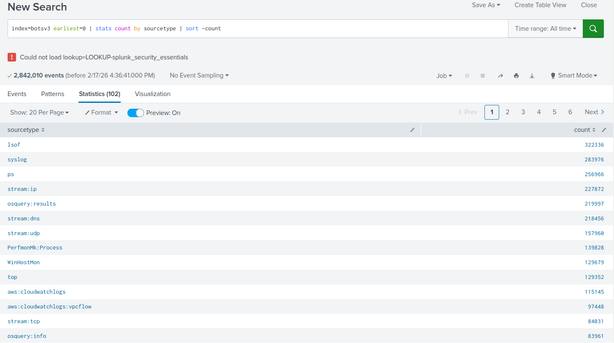
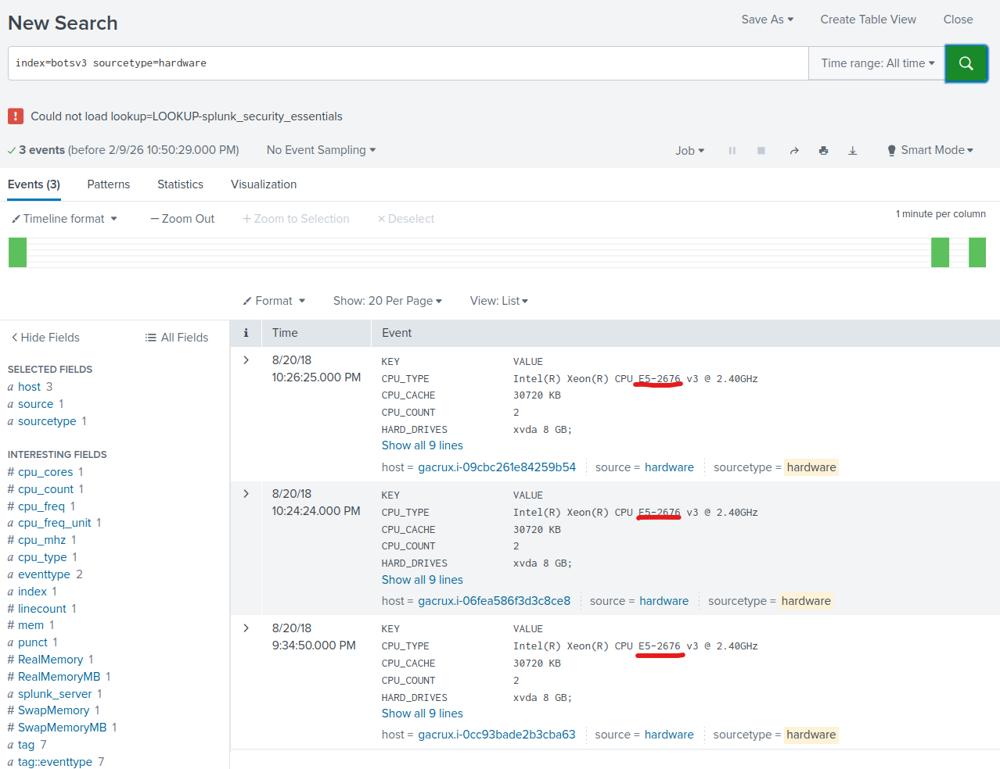
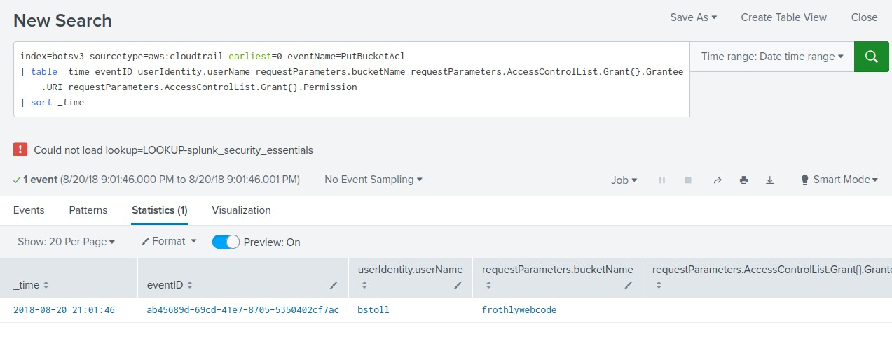
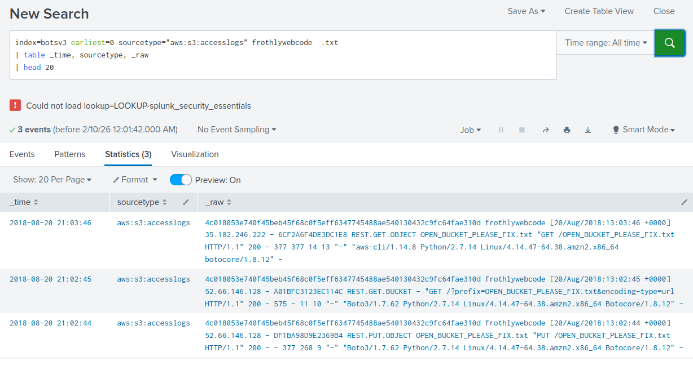
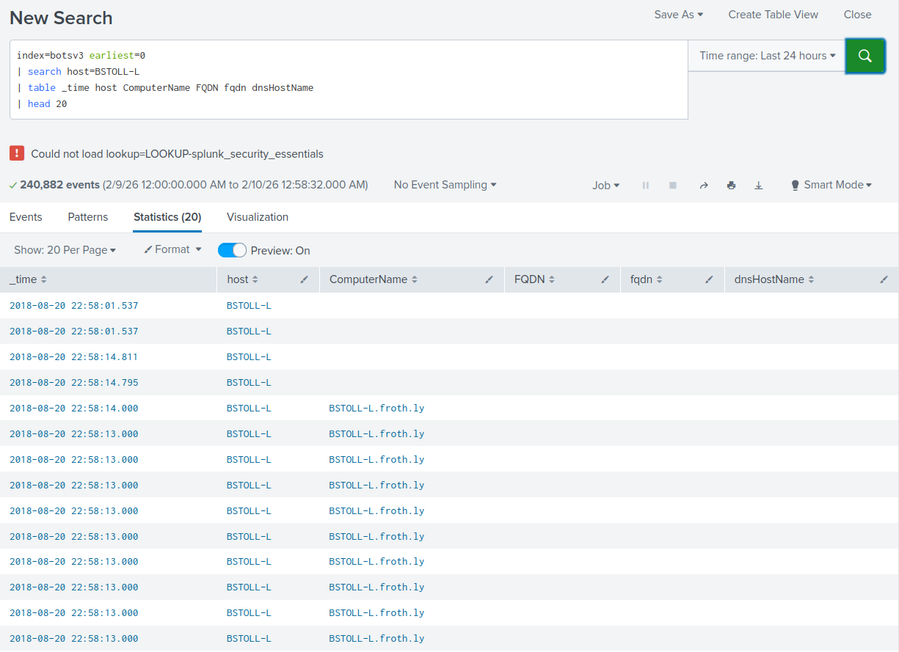

# COMP3010HK Coursework 2 — BOTSv3 Incident Analysis Report

**GitHub Repository:** https://github.com/wongoining/COMP3010HK_2_oi

**Video Walkthrough:** *(YouTube link to be added)*

---

## Table of Contents

1. [Introduction](#1-introduction)
2. [SOC Roles & Incident Handling Reflection](#2-soc-roles--incident-handling-reflection)
3. [Installation & Data Preparation](#3-installation--data-preparation)
4. [Analysis](#4-analysis)
5. [Conclusion](#5-conclusion)
6. [References](#references)

---

## 1. Introduction

The BOTSv3 (Boss of the SOC Version 3) dataset simulates a multi-stage security incident at Frothly, a fictitious craft beer company, reflecting operational scenarios commonly encountered in real-world Security Operations Centers (SOCs). The dataset integrates diverse log sources, including network traffic, endpoint telemetry, cloud service logs from AWS and Azure, and email communications. This multi-source integration enables comprehensive security incident analysis through the Splunk SIEM platform.

This investigation analyzes security incidents within the Frothly environment, with particular emphasis on identifying AWS misconfigurations, anomalous activities, and potential intrusion behaviors. The analysis focuses on AWS Identity and Access Management (IAM), S3 bucket security, and Windows endpoint configurations. Through structured Splunk queries and evidence-based analytical processes, this report demonstrates practical applications of SOC methodologies across detection, analysis, and incident response activities.

The scope of this analysis addresses eight AWS and endpoint-related questions within BOTSv3's 200-level investigation set. Rather than providing exhaustive dataset coverage, the investigation prioritises authentic SOC workflows, through the effective use of Splunk Search Processing Language (SPL) to support incident analysis. This report systematically documents the investigation process and interprets findings from a SOC operational perspective, presenting actionable insights to inform improvement in cloud security monitoring, detection strategies, and incident response capabilities.

---

## 2. SOC Roles & Incident Handling Reflection

Security Operations Centres commonly operate under a tiered model to manage incidents through structured escalation and role separation, and this operational logic is reflected in the BOTSv3 investigation. During the initial stages of analysis, the identification of anomalous AWS and endpoint activities through Splunk queries aligns with monitoring and triage functions typically associated with lower-tier SOC operations, where the primary objective is to recognise deviations from normal behaviour rather than to fully assess impact.

As the investigation progressed, the identification of S3 bucket misconfigurations and abnormal IAM activity required deeper analysis and correlation across multiple data sources, including CloudTrail and endpoint logs. This escalation reflects higher-tier SOC responsibilities, where analysts focus on determining incident scope, assessing potential impact, and supporting informed decision-making. The subsequent development of remediation and preventive recommendations, such as access control adjustments and credential review, represents a strategic response planning function rather than direct technical containment.

From an incident handling perspective, the BOTSv3 exercise primarily emphasises detection and analysis stages, with response activities limited to planning and recommendation rather than live remediation. This approach mirrors real-world SOC practices, where analytical validation and structured decision-making precede operational response. Overall, the investigation demonstrates how SOC roles and incident handling methodologies are practically applied within a realistic analytical context, highlighting the value of escalation, coordination, and reflective analysis in strengthening organisational security posture.

---

## 3. Installation & Data Preparation

The investigation environment was established using Splunk Enterprise 10.0.2 deployed on an Ubuntu 24.04.3 LTS platform, providing a controlled and realistic setting that reflects a typical Security Operations Centre (SOC) analytics infrastructure. This configuration supports centralised log aggregation, query-driven investigation, and evidence preservation, which are core capabilities required for professional security analysis.

### 3.1 Environment Setup

Splunk Enterprise was installed alongside the required applications and add-ons specified by the BOTSv3 documentation, ensuring compatibility with the dataset and consistency with the intended analytical environment. Default index configurations were retained to align with the assumptions embedded within the BOTSv3 design.

### 3.2 Dataset Acquisition and Validation

The BOTSv3 dataset was obtained directly from the official Splunk GitHub repository (https://github.com/splunk/botsv3). Prior to deployment, dataset integrity was verified using the published MD5 hash to confirm that the downloaded archive was complete and unaltered. This verification step is critical in SOC operations to ensure evidence integrity and maintain chain of custody throughout the investigation process.

MD5 Code Matching: d7ccca99a01cff070dff3c139cdc10eb

### 3.3 Data Ingestion Process

As the BOTSv3 dataset is distributed in a pre-indexed format, no custom indexing, parsing, or data normalisation was required. Following extraction of the archive, an initial deployment issue was identified in which the physical location of the pre-indexed buckets was not fully aligned with Splunk's standard index storage paths. This resulted in the dataset not being immediately queryable despite successful installation.

To address this, a deployment-level correction was applied to align the BOTSv3 index configuration with Splunk's standard storage layout. The index paths were updated to reference the default Splunk database location, and the pre-indexed buckets were relocated accordingly. This adjustment ensured that Splunk could correctly recognise and load the existing indexed data without altering the dataset structure or performing re-indexing.

Once the alignment was completed and Splunk restarted, the BOTSv3 data became fully accessible through the predefined index. This approach preserves the integrity and consistency of the official pre-indexed dataset while ensuring reliable ingestion and queryability within the investigation environment.

### 3.4 Post-Ingestion Validation

Comprehensive validation was conducted to confirm successful data ingestion and environment readiness.

**Validation Results:**

| Metric | Value |
|--------|-------|
| Total Events | 2,842,010 |



**Primary Sourcetypes:**

| Sourcetype | Event Count | Relevance |
|------------|-------------|-----------|
| `WinHostMon` | 129,679 | Windows endpoint monitoring |
| `aws:cloudwatchlogs` | 115,145 | AWS service logs |
| `aws:cloudwatchlogs:vpcflow` | 97,448 | VPC network flows |
| `WinEventLog` | 48,101 | Windows security events |
| `aws:rds:audit` | 35,192 | Database audit trails |
| `aws:cloudtrail` | 6,571 | AWS API activity |

These sourcetypes were prioritised based on their direct relevance to the AWS security and Windows endpoint investigation focus. The dataset also includes extensive system monitoring data (`stream:*`, `lsof`, `syslog`, `ps`) providing comprehensive coverage across network, endpoint, and cloud infrastructure domains. All expected data sources were verified as present and temporally consistent, confirming the environment was ready for analytical operations.

**Validation Query:**

```spl
index=botsv3 earliest=0
| stats count by sourcetype
| sort - count
```

### 3.5 SOC Infrastructure Alignment

From a SOC infrastructure perspective, this deployment mirrors operational practices in which analysts work with trusted, standardised data sources within a centralised SIEM platform. The validated environment supports query-driven investigation, cross-source correlation, and evidence preservation, providing a robust foundation for the subsequent BOTSv3 incident analysis.

---

## 4. Analysis

This section presents a structured technical analysis of the incident identified within the BOTSv3 environment. The investigation follows a Security Operations Centre (SOC) analytical workflow, progressing from identity visibility and authentication context, to cloud configuration analysis, impact validation, and endpoint attribution. All findings are derived from log-based evidence and corroborated through cross-source correlation.

The primary data sources used in this analysis include AWS CloudTrail logs, S3 access logs, and Windows endpoint monitoring data. By correlating identity activity, access control changes, and endpoint telemetry, the investigation establishes a coherent and technically supported incident narrative.

### 4.1 Identity and Authentication Context

The investigation began with an examination of AWS CloudTrail logs to establish visibility into identity activity within the environment. Enumerating IAM users based on recorded API interactions provided an initial behavioural baseline. Four IAM users were observed interacting with AWS services during the relevant timeframe.

```spl
index=botsv3 sourcetype=aws:cloudtrail earliest=0
| stats count by userIdentity.userName
| where isnotnull(userIdentity.userName)
| sort userIdentity.userName
```


Subsequent analysis focused on authentication context, specifically the presence or absence of multi-factor authentication (MFA) during API execution. The relevant CloudTrail field is `userIdentity.sessionContext.attributes.mfaAuthenticated`. CloudTrail session attributes indicated that certain API calls were performed without MFA enforcement.

```spl
index=botsv3 sourcetype=aws:cloudtrail earliest=0 *mfa*
```


While no evidence of credential compromise was identified, the absence of MFA reduces the security assurance level associated with privileged operations. In cloud environments, insufficient authentication controls can amplify the impact of configuration errors or misuse of legitimate credentials. Establishing this identity and authentication baseline provided contextual grounding for evaluating later security-sensitive actions.

### 4.2 Infrastructure Context

To support environmental validation, system telemetry data was reviewed to understand the operational characteristics of the environment. Hardware information indicated that relevant systems were operating on Intel Xeon E5-2676 processors, consistent with enterprise or cloud-hosted infrastructure.

```spl
index=botsv3 sourcetype=hardware
```



Although this information does not indicate malicious activity, it confirms that observed behaviours occurred within a realistic enterprise-grade operating context. This contextual understanding supports the credibility of subsequent cross-domain correlations.

### 4.3 S3 Access Control Modification and Exposure

The core security event identified in this investigation involved a modification to an S3 bucket's access control configuration. CloudTrail logs were analysed for the `PutBucketAcl` API action, which is used to modify a bucket's Access Control List (ACL). ACLs define which principals may perform read, write, or administrative operations on an S3 bucket. If misconfigured, ACL changes can expose resources to unintended entities, including the global "AllUsers" group.

```spl
index=botsv3 sourcetype=aws:cloudtrail earliest=0 eventName=PutBucketAcl
| table _time eventID userIdentity.userName requestParameters.bucketName requestParameters.AccessControlList.Grant{}.Grantee.URI requestParameters.AccessControlList.Grant{}.Permission
| sort _time
```



The analysis revealed that the IAM user `bstoll` executed a `PutBucketAcl` operation affecting the S3 bucket `frothlywebcode`. Inspection of the request parameters confirmed that the ACL modification granted access permissions in a manner that resulted in public accessibility, effectively exposing the bucket. The critical event details are:

| Field | Value |
|-------|-------|
| Event ID | `ab45689d-69cd-41e7-8705-5350402cf7ac` |
| Timestamp | 2018-08-20 13:01:46 UTC |
| IAM User | `bstoll` |
| Bucket | `frothlywebcode` |
| Grant | `FULL_CONTROL` to `AllUsers` |

It is important to note that `PutBucketAcl` modifies bucket-level ACL settings and does not alter bucket policies. The exposure identified in this case was attributable to the ACL configuration itself. The event originated from an authenticated user context, indicating that the exposure resulted from a configuration error rather than an external unauthorised intrusion.

### 4.4 Impact Verification Through S3 Access Logs

To determine whether the exposed bucket was actively accessed, S3 access logs were analysed for object-level operations following the ACL modification. The review identified successful object upload activity associated with the affected bucket during the exposure window.

```spl
index=botsv3 sourcetype=aws:s3:accesslogs0 frothlywebcode .txt
| table _time, sourcetype, _raw
| sort _time
```



A file named `OPEN_BUCKET_PLEASE_FIX.txt` was written to the bucket via a `REST.PUT.OBJECT` operation (HTTP 200), confirming that the public accessibility was not merely theoretical but was actively exploited. The presence of this file demonstrates that the misconfiguration resulted in unauthorised interaction with the resource. The analysis does not attribute the upload to a specific external actor; however, it establishes that the exposure materially increased risk and allowed unintended object-level operations. This progression from configuration change to verified impact confirms the severity of the incident.

### 4.5 Endpoint Attribution and Correlation

The final stage of the investigation focused on identifying the endpoint associated with the configuration change. Windows endpoint monitoring data (`winhostmon`) was analysed to identify systems operating under differing configurations.

The endpoint `BSTOLL-L` was identified as the only system running Windows 10 Enterprise, while other endpoints in the environment were running Windows 10 Pro, making it an environmental outlier. 

```spl
index=botsv3 sourcetype=winhostmon earliest=0
|dedup host, OS
|table host, OS
|sort host
```


Further correlation with Windows event logs confirmed that the fully qualified domain name (FQDN) of this endpoint was `BSTOLL-L.froth.ly`. By aligning endpoint data with CloudTrail activity attributed to user `bstoll`, the investigation established a technically supported association between the administrative workstation and the `PutBucketAcl` operation affecting the S3 bucket.

```spl
index=botsv3 earliest=0
| search host=BSTOLL-L
| table _time host ComputerName FQDN fqdn dnsHostName
| head 20
```



Although the dataset does not contain host-level forensic artefacts (such as process execution records explicitly invoking AWS CLI commands), the correlation across identity logs, access control modification events, and endpoint characteristics provides sufficient evidential support to associate the administrative workstation with the S3 ACL misconfiguration.

---

## 5. Conclusion

This investigation identified a cloud security incident arising from an S3 access control misconfiguration. An authenticated IAM user executed a `PutBucketAcl` operation that rendered the bucket `frothlywebcode` publicly accessible. Subsequent analysis of S3 access logs confirmed unauthorised file upload activity, demonstrating that the exposure was operationally exploitable rather than theoretical. Correlation of identity logs, API activity, and endpoint telemetry further associated the incident with the administrative workstation `BSTOLL-L.froth.ly`.

The root cause was a configuration error performed under legitimate credentials, highlighting the security risks posed by insufficient governance over privileged operations. The absence of enforced multi-factor authentication (MFA) and real-time monitoring increased the potential impact of the misconfiguration.

From a SOC perspective, this case underscores the importance of cross-source log correlation and proactive monitoring of high-risk API actions. Strengthening access governance, enforcing MFA, and implementing timely detection controls are essential to reducing the likelihood and impact of similar cloud misconfiguration incidents.

---

## References

- AWS ACL Overview: https://docs.aws.amazon.com/AmazonS3/latest/API/API_PutBucketAcl.html
- AWS CloudTrail User Guide: https://docs.aws.amazon.com/pdfs/awscloudtrail/latest/userguide/awscloudtrail-ug.pdf
- AWS S3 PutObject API Reference: https://docs.aws.amazon.com/AmazonS3/latest/API/API_PutObject.html
- BOTSv3 Dataset: https://github.com/splunk/botsv3
